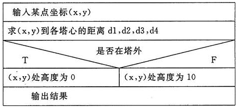

# 考研真题精选

讲师：尚硅谷-宋红康（江湖人称：康师傅）

官网：[http://www.atguigu.com](http://www.atguigu.com/)

***

## 第01章：C语言入门


### 输出格式

>  【华南理工大学2018研】十六进制形式输出整数的格式说明符是（　　）。
>
>  A．%u
>  B．%ld
>  C．%x
>  D．%o
>
>  【答案】C
>
>  【解析】A表示输出的是无符号整型；B表示输出的是有符号长整型；D表示输出的是八进制。


### 预处理指令

>  【中央财经大学2018研】以下叙述错误的是（　　）。
>  A．在程序中凡是以“#”开始的语句行都是预处理命令行
>  B．预处理命令行的最后不能以分号表示结束
>  C．#include MAX是合法的宏定义命令行
>  D．C程序对预处理命令行的处理是在程序执行的过程中进行的
>
>  【答案】D
>
>  【解析】在C语言中，凡是以“#”开头的行都称为编译预处理命令行，为了区别C语句，后面是不加分号的。编译预处理是在编译程序对C源程序进行编译前执行的，而不是在程序执行过程中进行的。


## 第02章：变量与进制

### 标识符

> 【武汉科技大学2019研】
>
> 以下均是合法变量名的是（　　）。
> A．#name   total
> B．node 　value_max
> C．_var 　long
> D．stu－code   a＋b
>
> 【答案】B
>
> 【解析】C语言中变量名只能包含数字，字母和下划线，且只能以字母和下划线开始。A项含非法字符#，错误；C中long为关键字，变量不能以关键字命名；D中含非法字符－和＋。


>  【四川大学2017研】以下不合法的用户标识符是（　　）。
>  A．J2_KEY
>  B．Double
>  C．4d
>  D．\_8_
>
>  【答案】C
>
>  【解析】标识符只能包含数字，字母，下划线，且不能以数字开头，选项C错误。


### 数据类型

> 【武汉科技大学2019研】
>
> 以下选项中不属于C语言类型的是（　　）。
> A．short int
> B．unsigned long int
> C．char
> D．bool
>
> 【答案】D
>
> 【解析】C语言中没有bool型，只有C＋＋才有boolean型，也称bool。C语言中一般用“0”表示“假”，用“1”表示“真”。


>  【中央财经大学2018研】以下程序运行后的输出结果是（　　）。
>
>  ```c
>  int main(){  
>    	double d;  
>    	float f;  
>    	long l;  
>    	int i;  
>    	i=f=l=d=20/3;  
>    	printf("%d %ld %.1f %.1f\n",i,l,f,d);  
>    	return 0;
>  } 
>  ```
>
>  A．6 6 6.0 6.0
>  B．6 6 6.7 6.7
>  C．6 6 6.0 6.7
>  D．6 6 6.7 6.0
>
>  【答案】C
>
>  【解析】赋值运算符是自右向左结合的，所以首先执行d＝20/3＝6，同时i、l、f也全为6，在进行输出时，f和d要保留一位小数，所以答案选C。


> 【四川大学2017研】有4个圆塔，圆心分别为（2，2）、（－2，2）、（－2，－2）、（2，－2），圆半径为1。这4个塔的高度为10m，塔以外无建筑物。今输入任一点的坐标，求该点的建筑高度（塔外的高度为零）。
>
> 【答案】
> N-S图如图1所示。
>
> 
>
> ​										图1　计算某点建筑高度的N-S流程图
> 程序如下：
>
> ```c
> #include<stdio.h>
> int main(){  
>      int h=10;  
>      float x1=2,y1=2,x2=-2,y2=-2,x3=-2,y3=-2,x4=2,y4=-2,x,y,d1,d2,d3,d4;  
>      printf("请输入一个点(x,y)：");  
>      scanf("%f,%f",&x,&y);  
>      d1=(x-x4)*(x-x4)+(y-y4)*(y-y4); //求该点到各中心点距离  
>      d2=(x-x1)*(x-x1)+(y-y1)*(y-y1);  
>      d3=(x-x2)*(x-x2)+(y-y2)*(y-y2);  
>      d4=(x-x3)*(x-x3)+(y-y3)*(y-y3);  
>      if(d1>1&&d2>1&&d3>1&&d4>1) //判断该点是否在塔外  
>        	h=0; 
>      printf("该点高度为%d\n",h);  
>      return 0;
> } 
> ```


### scanf输入

> 【武汉科技大学2019研】
>
> 若有声明语句：int x； char y[20]； double z；则正确的输入语句是（　　）。
> A．scanf（"%d%c%le\n"，&x，&y，&z）；
> B．scanf（"%2d%s%lf"，&x，&y，&z）；
> C．scanf（"%d%s%lf"，&x，y，&z）；
> D．scanf（"%x%s%3.2f"，&x，y，&z）；
>
> 【答案】C
>
> 【解析】y为一维数组名，指向数组首元素的地址，因此不需要再使用取地址运算符&，AB错误；D中%3.2f表示长度为3，小数为2位，但是小数点也占一位，因此D错误，答案选C。


### 进制


>  【华南理工大学2018研】与十进制1100等值的十六进制数是（　　）。
>  A．44A
>  B．44C
>  C．54A
>  D．54C
>
>  【答案】B
>
>  【解析】1100转换成二进制为0100 0100 1100，因此转换为十六进制为44C。


### 常量


> 【北京航空航天大学2018研】若已知有如下宏定义
>
> ```c
> #define  CANBERRA(x，y)  ((x－y)/(x＋y))
> ```
>
> 则以下表达式中，返回结果值最大的是（　　）。
> A．CANBERRA（3.0，2.0）；
> B．CANBERRA（4.0，1.0）；
> C．CANBERRA（1.0＋2.0，0.0＋2.0）；
> D．CANBERRA（1.0＋2.0，1.0＋1.0）；
>
> 【答案】C
>
> 【解析】A项中为1.0/5.0，结果为0.2；B项中为3.0/5.0，结果为0.6；C项中的宏替换后为（1.0＋2.0－0.0＋2.0）/（1.0＋2.0＋0＋2.0）＝1.0；D项中宏替换后为（1.0＋2.0－1.0＋1.0）/（1.0＋2.0＋1.0＋1.0）＝0.6，因此最后答案为C。


> 【中央财经大学2018研】若有如下宏定义：
>
> ```c
> #define  N  2
> #define  y(n)  ((N＋1)*n)
> ```
>
> 则执行下列语句：z＝4\*（N＋y（5））；后的结果是（ 　）。
> A．语句有错误
> B．z值为68
> C．z值为60
> D．z值为180
>
> 【答案】B
>
> 【解析】y（5）＝15，z＝4\*（N＋y（5））＝4*17＝68，答案选B。


## 第03章：运算符与流程控制

### 赋值运算符

> 【武汉科技大学2019研】
>
> 若a、b和t都为int变量，则下面不能交换变量a和b值的是（　　）。
> A．t＝a； a＝b； b＝t；
> B．a＝t； t＝b； b＝a；
> C．t＝b； b＝a； a＝t；
> D．a＝a＋b； b＝a－b； a＝a－b；
>
> 【答案】B
>
> 【解析】B中首先把t的值赋值给了a，则a的值已经被取代了，后面执行b＝a，则ab的值都等于t的值。

### 比较运算符


>  【北京航空航天大学2018研】若变量a，b，c的取值分别是1，2，3，则表达式“!（（b＋c）＞（a＋4））”的值是（　）。
>  A．0
>  B．1
>  C．2
>  D．3
>
>  【答案】B
>
>  【解析】首先b＋c等于5，a＋4也等于5，因此（b＋c）＞（a＋4）为“假”，即0，对0取非结果为1，因此答案为B。


### 逻辑运算符


>  【华南理工大学2018研】设int a＝3；，下列哪一个表达式的值等于0（　　）。
>  A．a&&（a＞0）
>  B．!a||a
>  C．a%＝a
>  D．a＞＝a
>
>  【答案】C
>
>  【解析】A中a!＝0且a＞0所以表达式的值为1；B中||表示或，所以值也为1；D中表达式值也为1；答案选C。


>  【四川大学2017研】语句：printf（"%d"，（a＝2）&&（b＝－2））；的输出结果是（　　）。
>  A．无输出
>  B．结果不确定
>  C．－1
>  D．1
>
>  【答案】D
>
>  【解析】a＝2为真，b＝－2也为真，所以输出1，答案选D。


### 三元运算符


>  【华南理工大学2018研】输入一个字符，判别它是否为大写字母，如果是，将它变为小写字母；如果不是，不转换。然后输出最后得到的字符。请在下面空白处填上适当语句。
>
>  ```c
>  #include<stdio.h>
>  int main(){ 
>        char ch;  
>        scanf("%c", ① );  
>        ch=(ch>='A'&& ② )?(ch+32): ③ ;  
>        printf( ④ ,ch);  
>        return ⑤ ;
>  } 
>  ```
>
>  【答案】①&ch②ch＜＝'Z'③ch④"%c"⑤0
>
>  【解析】程序进行输入时要加上地址符&；main函数中的第三行为一个三目运算符，当ch在A～Z之间时ch为真，此时ch＋32变为小写字母，否则不变；程序进行输出时应用%加上数据类型进行输出，最后用return 0来结束程序。


### if-else


> 【武汉科技大学2019研】对下述程序段的描述正确的是（　　）。
>
> ```c
> scanf("%d,%d",&a,&b);
> if(a>b)  
>  	a=b;b=a;
> else  
>  	a++; b++;
> printf("a=%d,b=%d",a,b); 
> ```
>
> A．若输入4，5则输出a＝5，b＝6
> B．若输入5，4则输出a＝4，b＝5
> C．若输入5，4则输出a＝5，b＝5
> D．有语法错误，不能通过编译
>
> 【答案】D
>
> 【解析】if（表达式）后面如果没有用花括号括起来，那么if的子语句只包括第一条语句，即在程序中只有a＝b是属于if语句块的，if和else中间隔了一条语句b＝a，编译无法通过。


>  【华南理工大学2018研】两次运行下面的程序，如果从键盘上分别输入6和4，则输出的结果是（　　）
>
>  ```c
>  void main(void){  
>    int x;  
>    scanf(“%d”,&x);  
>    if(x++>5) 
>        printf(“%d”,x);  
>    else 
>        printf(“%d\n”,x--);
>  } 
>  ```
>
>  A．7和5
>  B．6和3
>  C．7和4
>  D．6和4
>
>  【答案】A
>
>  【解析】当输入6时，判断x＋＋＞5为真，进入if语句块，此时x＝7，输出7；当输入4时，进入else语句块，此时x＝5，然后因为－－是先运算后自减，所以先输出5，后x的值为4，答案选A。


>  【北京航空航天大学2018研】对于以下C程序，其正确的是（　　）。
>
>  ```c
>  #include<stdio.h>
>  
>  int main(){  
>  char str1[]="Hello";  
>  char str2[]="Hello";  
>  if(str1==str2)    
>      printf("Equal\n");  
>  else    
>      printf("Unequal\n");  
>  return 0;
>  } 
>  ```
>
>  A．Unequal
>  B．Equal
>  C．该程序无法通过编译
>  D．该程序运行时出错
>
>  【答案】A
>
>  【解析】首先该程序符合语法规则，因此不会编译时产生错误，其次字符数组str1和str2都为指针常量，将他们直接用关系运算符进行比较肯定是不相等的，但是它们所指的字符串是相等的，因此最后输出Unequal。


### switch-case

> 【武汉科技大学2019研】若有定义：int a＝1，b＝2； float x＝3，w； 则合法的switch语句是（　　）。
>
> A.
>
> ```c
> switch (a) {
>     case 1:
>         w = a / b;
>         break;
>     case 2:
>         w = a % b;
>         break;
> }
> ```
>
>
> B．
>
> ```c
> switch (b) {
>     case 1:
>         z = a % b;
>     case 2:
>         z = a / b;
>         break;
> }
> ```
>
> C．
>
> ```c
> switch (x) {
>     case 2:
>         w = a % b;
>         break;
>     case 1:
>         w = a / b;
>         break;
> }
> ```
>
> D．
>
> ```c
> switch (a + b);{
>     case 3:
>     case 2:
>     w = a % b;
>     break;
> }
> ```
>
> 【答案】A
>
> 【解析】B中，变量z未定义；C中x为浮点型，switch后面的表达式不能是浮点型，只能是整型和字符型；D中swith表达式后面不能加分号，答案选A。


> 【北京航空航天大学2018研】对于下列代码：
>
> ```c
> switch(option){
>     case 'H':printf("Hello ");
>     case 'W':
>         printf("Welcome ");
>     case 'B':
>         printf("Bye");
>         break;
> }
> ```
>
> 若option的取值为'W'，则该代码段的输出结果是（　　）。
> A．Welcome
> B．Welcome Bye
> C．Hello Welcome Bye
> D．以上结果都不对
>
> 【答案】B
>
> 【解析】由于option为'W'，所以首先应该输出Welcome，但是由于该语句后面没有break语句来终止选择语句switch，因此会继续执行下面的语句，直到遇上break，所以最后输出Welcome Bye，答案为B。


### for

> 【华南理工大学2018研】有一个分数序列$2/1,3/2,5/3,8/5,13/8,21/13,...$,求这个数列的前20项之和。请在下面空白处填上适当语句。
>
> ```c
> int main(){  
>      int i,n=20;  
>      double a=2,b=1,s=0,t;  
>      for(i=1; ① ;i++){    
>           s= ② ;        
>           ③ ;   
>           a=a+b;        
>           ④ ;  
>      }  
>      printf("sum=%16.10f\n", ⑤ );  
>      return 0;
> } 
> ```
>
> 【答案】①i＜＝n②s＋a/b③t＝a④b＝t⑤s
>
> 【解析】此程序循环是从＝1开始，所以要计算数列前20项，则循环条件应为i＜＝n；s用来累加求和，所以每次进行累加操作，即s＝s＋a/b；通过分析数列可知，数列中分子是上一项的分子分母之和，而分母是上一项的分子，依照此关系可以通过中间变量t进行换算，最后输出所求结果s。


> 【华南理工大学2018研】从键盘输入10个整数，编程求其中大于3且小于100的数的平均值并输出结果。
>
> 【答案】
> 此题可以先利用循环从屏幕读取10个数，存放在一个一位数组中，然后循环判断大于3且小于100的数，最后取平均值进行输出，程序如下：
>
> ```c
> #include<stdio.h>
> void main(){  
>      int num[10],s=0,n=10;  
>      printf("input 10 numbers:");  
>      for(int i=0;i<10;i++)  {  
>          scanf("%d",&num[i]);    
>          if(num[i]<=3||num[i]>=100)    
>          {      
>              num[i]=0;      
>              n--;    
>          }    
>          s+=num[i];  
>      }  
>      if(n==0)    
>          printf("no exist!");  
>      else    
>          printf("%d\n",s/n);
> } 
> ```


### while

>  【武汉科技大学2019研】如果有定义：int x＝0，s＝0； 则下面程序段的执行结果是（　　）。
>
>  ```c
>  while(!x!= 0)  
>    	s+=x++;
>  printf(“%d”,s);
>  ```
>
>  A．1
>  B．0
>  C．无限循环
>  D．控制表达式非法，无法编译
>
>  【答案】B
>
>  【解析】while后面的表达式中，首先执行!运算符，然后再执行!＝运算符，第一次判断中，x＝0则!x!＝0满足条件，进入循环中，执行s＋＝x＋＋，x＋＋是先运算，再自加，执行完后s＝0，x＝1，再回到while的判断条件，判断为false，跳出循环，输出s的值为0，答案选B。


> 【北京航空航天大学2018研】对于下列for循环语句，请将其改写为功能完全相同的while循环语句。
>
> ```c
> int i,j,count=0;
> for(i＝0;i＜100;i++){  
>      for(j=100;j>=i;j-=2)  {    
>          count+=j-i;  
>      }
> } 
> ```
>
> 【答案】
> 此题可以在定义时先令i＝0，j＝100，在第一层while循环时只需判断i＜100即可，在第二层while循环时只需判断j＞＝i即可，j－＝2放在内层循环体中即可，具体程序如下：
>
> ```c
> int i=0, j=100, count=0;
> while(i<100){  
>      while(j>=i)  {    
>          count+=j-i;    
>          j-=2;  
>      }  
>      i++;
> } 
> ```


### break

> 【华南理工大学2018研】编程求100～200间的全部素数。
>
> 【答案】
> 素数意思是只能被1和本身整除，因此将1到本身之间的数做除数，进行求余，如果余数为0，则不是素数，否则是素数。根据经验，假设所要判断的数为n，则一般只需要判断1到根号n之间的数即可，具体程序如下：
>
> ```c
> #include<stdio.h>
> #include<math.h>
> 
> void main() {
>     int i, j, count;
>     for (i = 100; i <= 200; i++) {
>         count = 0;
>         for (j = 2; j < sqrt(i); j++) {
>             if (i % j == 0)
>                 count++;
>         }
>         if (count == 0)
>             printf("%d 是素数!\n", i);
>     }
> } 
> ```


### continue

> 【武汉科技大学2019研】以下正确的描述是（　　）。
> A．从多层循环嵌套中退出时，只能使用break语句
> B．在循环体内使用continue和break语句，作用相同
> C．只能在循环体内和switch体内使用break语句
> D．continue语句的作用是结束整个循环的执行
>
> 【答案】C
>
> 【解析】从多层嵌套中退出不是只能使用break语句，也可以使用return或者程序自己执行完，A错误；在循环体内continue代表不执行该次循环中的剩余未执行语句，break代表直接跳出本层循环，BD错误，答案选C。


>  【北京航空航天大学2018研】以下关于循环语句的叙述中，正确的是（　　）。
>  A．for循环语句的三个部分必须都要有表达式
>  B．while循环语句的循环体内至少要有一条语句
>  C．do…while循环语句的循环体至少会被执行一次
>  D．continue语句可以退出包含它的整个循环体
>
>  【答案】C
>
>  【解析】for循环的三个表达式都可以省略，但是之间的分号不能省略，同时要有退出循环的机制，因此A项错误；while循环语句的循环体内可以为空，并不违反相应语法，只不过循环什么也不执行，因此B项错误；continue语句只是不执行本次循环的剩余语句，而并非退出整个循环，因此D项错误，答案选C。


## 第04章：数组

### 赋值

>  【武汉科技大学2019研】以下能对数组value进行正确初始化的语句是（　　）。
>  A．int value\[2][]＝{{1，1}，{2，2}}；
>  B．int value[][3]＝{{1，，3}，{4，5，6}}；
>  C．int value\[2][3]＝{1，2，3，4，5，6}；
>  D．int value[][3]＝{{1}，{4，6，}}；
>
>  【答案】C
>
>  【解析】二维数组的定义必须指定列数，可以不用指定行数，A错误；数组value为int型数组，不能给数组里面的元素赋空值，BD错误，答案选C。


### 二维数组

> 【华南理工大学2018研】以下数组定义中不正确的是（　　）。
> A．int a\[2][3]；
> B．int b[][3]＝{0}；
> C．int c\[100][100]＝{0}；
> D．int d\[3][]＝{{1}， {1， 2， 3}，{1}}；
>
> 【答案】D
>
> 【解析】定义二维数组时一定要指定数组的列数，可以不指定数组的行数，D错误。


### char[]与字符串

>  【中央财经大学2018研】若有定义和语句：char s[10]；s＝"abcd"；printf（"%s\n"，s）；，则结果是（　　）。
>  A．输出abcd@#$
>  B．输出a
>  C．输出abcd
>  D．编译不通过
>
>  【答案】D
>
>  【解析】在定义一维字符数组时，s为数组名，指向数组首元素的地址，为地址常量，不可更改，因此语句s＝"abcd"是非法的，编译不会通过。


## 第05章：指针

### &和*运算符

> 【华南理工大学2018研】若有说明：int \*p，m＝5，n；，以下正确的程序段是（　　）。
> A．
>
> ```c
> p=&n;  
> scanf("%d",n); 
> ```
>
> B．
>
> ```c
> p=&n;  
> scanf("%d",*p); 
> ```
>
> C．
>
> ```c
> scanf("%d",&n);  
> p=n 
> ```
>
> D．
>
> ```c
> p=&n;  
> *p=n; 
> ```
>
> 【答案】D
>
> 【解析】scanf语句中第二个参数应该是变量的地址，AB错误；C中p为指针变量，不可以直接把一个int型变量赋值给指针型，C错误；答案选D。


>  【华南理工大学2018研】若有定义：int \*p，\*s，c；，且各变量已正确赋值，则非法的赋值表达式是（　　）。
>  A．p＝s
>  B．c＝\*s
>  C．*s＝&p
>  D．p＝&c
>
>  【答案】C
>
>  【解析】C中p为指针变量，则&p表示的是指针的地址，若要赋值，则左边变量应该是一个二级指针，而*s代表的是s所指向地址的变量值，这个变量是一个int型，显然不正确。


> 【北京航空航天大学2018研】已知有以下sample.c程序的定义：
>
> ```c
> /*sample.c*/
> #include <stdio.h>
> 
> int main(int argc,char *argv[]){  
>     printf("%c",*++argv[2]);  
>     return 0;
> } 
> ```
>
> 将该程序编译成可执行文件sample后，若在命令行下输入如下命令：
> sample  January  February  March
> 则该命令正确的输出是（　　）。
> A．J
> B．a
> C．F
> D．e
>
> 【答案】D
>
> 【解析】根据命令行的输入可知，四个字符串赋给相应的指针数组，所以argv[2]表示第三个字符串February，再进行＋＋操作，指针指向字符串的第二个字符e，最后进行取值操作，结果为e，答案为D。


### 指针与数组

>【华南理工大学2018研】若有以下说明：
>
>```c
>int w[3][4]＝{{0,1},{2,4},{5,8}};
>int (*p)[4]＝w;
>```
>
>则数值为4的表达式是（　）。
>A．\*w[1]＋1
>B．p++，*(p＋1)
>C．w\[2][2]
>D．p\[1][1]
>
>【答案】D
>
>【解析】A中\*w[1]表示的是数值2，则表达式的值为3，错误；B中p＋1表示指向二位数组第二行的首元素地址，而*（p＋1）代表的是第三行首元素值，B错误；C中表示的是数值0，答案选D。


> 【中央财经大学2018研】有如下说明
>
> ```c
> int a[10]={1,2,3,4,5,6,7,8,9,10}, *p＝a;
> ```
>
> 则数值为9的表达式是（　　）。
> A．\*p＋9
> B．\*（p＋8）
> C．*p＋＝9
> D．p＋8
>
> 【答案】B
>
> 【解析】A中\*p＝1，\*p＋9＝10，A错误。C中*p得到的是一个常量，常量不可以被赋值，C错误。D中p是地址，p＋8仍然表示一个地址。因此B项正确，p＋8指向元素9，进行取值得9。


> 【北京航空航天大学2018研】若有以下变量的声明语句：
>
> ```c
> int i＝1,a[]＝{0,2,4}, *b;
> b＝&i;
> ```
>
> 则下列选项中，其结果与表达式“\*（a＋1）”相等的是（　　）。
> A．a[0]
> B．\*a＋i
> C．\*（a＋b）
> D．\*（a＋*b）
>
> 【答案】D
>
> 【解析】a指向数组的首元素，因此\*（a＋1）表示取数组第二个元素的值，为2。A项，a[0]＝0，不相等；B项，\*a为数组第一个元素的值为0，再加上i＝1，因此结果为1，不相等；C项，a和b都是指针，相加没有意义，错误；D项，\*b的值i的值，即1，*（a＋1）表示取数组第二个元素的值为2，相等，因此答案选D。


## 第06章：函数

### 声明

>  【华南理工大学2018研】在C语言中，当函数的返回值缺省时，表示该函数返回值的类型是（　　）。
>  A．char
>  B．float
>  C．long
>  D．int
>
>  【答案】D
>
>  【解析】在C语言中，当函数的返回值缺省时，函数返回值的类型默认为int型。


> 【华南理工大学2018研】以下叙述中不正确的是（　　）。
> A．在不同的函数中可以使用相同名字的变量
> B．函数中的形式参数是局部变量
> C．在一个函数内定义的变量只能在本函数范围内有效
> D．在一个函数的复合语句中定义的变量在本函数范围内有效
>
> 【答案】D
>
> 【解析】在一个函数的复合语句中定义的变量只在该复合语句中有效。


> 【四川大学2017研】已定义如下函数：
>
> ```c
> fun（int *p）{
>  return *p；
> }
> ```
>
> 该函数的返回值是（　　）。
>
> A．不确定的值
> B．形参p中存放的值
> C．形参p所指存储单元中的值
> D．形参p的地址值
>
> 【答案】C
>
> 【解析】p是一个指向int型的指针变量，*p表示的是p所指向内存存放的变量，是一个int型，所以return *p表示返回p所指存储单元中的值，答案选C。


> 【四川大学2017研】在C语言中，形参的缺省存储类型是（　　）。
> A．auto
> B．register
> C．static
> D．extern
>
> 【答案】A
>
> 【解析】形参是局部变量，缺省类型为auto型。


### 调用

>  【武汉科技大学2019研】函数fun和实参数组的声明形式为：void fun（char ch，float x[]）； float a[5]；
>  以下对函数的调用语句中，正确的是（　　）。
>  A．fun（"a"，a[]）；
>  B．t＝fun（'D'，a）；
>  C．fun（'65'，2.8）；
>  D．fun（32，a[5]）；
>
>  【答案】B
>
>  【解析】调用函数fun需要传入两个实参，第一个实参的类型是char字符型，第二个实参的类型是float数组型，只有选项B满足条件。其中C项'65'本身有语法错误，D项在传递数组时只需要数组名即可。


>  【武汉科技大学2019研】设有定义int a\[3][3]；和函数调用语句sort（a，3）；则正确的函数声明是（　　）。
>  A．void sort（int a，n）；
>  B．void sort（int a\[][]，int n）；
>  C．void sort（int a\[][3]，int n）；
>  D．void sort（int a[][3]，n）；
>
>  【答案】C
>
>  【解析】根据函数调用语句可以知道sort函数有两个参数，第一个参数的类型是一个二维int型数组，第二个参数是一个int型数据，所以A错误；B中因为二维数组一定要指定列数，B错误；D中形参n没有指定数据类型，错误；答案选C。


> 【华南理工大学2018研】下列函数的功能是（　　）。
>
> ```c
> int fun1(char *x){  
>    char *y=x;  
>    while(* y++);  
>       return (y-x-1);
> } 
> ```
>
> A．求字符串的长度
> B．比较两个字符串的大小
> C．将字符串X复制到字符串Y
> D．将字符串X连接到字符串Y后
>
> 【答案】A
>
> 【解析】while后面的表达式是指针依次遍历直到碰到\0，此时y指向字符串最后一个元素的后一个位置，但是由于y＋＋，因此y会继续后移一位，而x指向字符串的头部，后面的y－x－1显然是用于计算字符串的长度。


### 指针

>  【武汉科技大学2019研】有函数定义：int func（int *p），x和y是int型变量，则正确的调用是（　　）。
>  A．y＝func（x）；
>  B．func（x）；
>  C．func（）＝x；
>  D．y＝func（&x）；
>
>  【答案】D
>
>  【解析】根据func函数的定义可以知道调用func函数需要传入一个指针，且该指针的指向类型是int型，只有D传入的是指向int型数据的指针，答案选D。


### static变量

>  【华南理工大学2018研】设有下列程序
>
>  ```c
>  ff( ){  
>    int c=9;  
>    static int a=1, b=4;  
>    if (b == 4)    
>    	{a+=c; b++;}  
>    else    
>    	{a+= c; b-- ;}  
>    printf (“a=%d,b=%d\n”, a, b);
>  }
>  main ( ){ 
>    ff( ); 
>    ff( ); 
>  } 
>  ```
>
>  则该程序执行后，显示的结果为（　　）。
>  A．a＝10，b＝5
>  a＝19，b＝5
>  B．a＝10，b＝4
>  a＝19，b＝5
>  C．a＝10，b＝4
>  a＝19，b＝4
>  D．a＝10，b＝5
>  a＝19，b＝4
>
>  【答案】D
>
>  【解析】第一次调用ff（）时，c＝9，a＝1，b＝4，程序进入if语句块，执行完后a＝10，b＝5；第二次调用ff（），因为a、b是静态变量，所以a、b的值不会重新初始化，所以进入else语句块，执行完后a＝19，b＝4，答案选D。


## 第07章：结构体与共用体

### 结构体变量

>  【武汉科技大学2019研】已知书籍结构定义如下，则对结构变量bk的正确赋值是（　　）。
>
>  ```c
>  struct BOOK{  
>    struct  {    
>        int year,month,day;  
>    }
>    publish;
>  }bk; 
>  ```
>
>  A．bk.year＝1998；  bk.month＝11；  bk.day＝11；
>  B．publish.year＝1998；  publish.month＝11；  publish.day＝11；
>  C．year＝1998；  month＝11；  day＝11；
>  D．bk.publish.year＝1998；  bk.publish.month＝11；  bk.publish.day＝11；
>
>  【答案】D
>
>  【解析】变量bk是结构体BOOK的一个结构体变量，该变量含有一个成员变量publish，publish也是一个结构体变量，该结构变量含三个成员变量，分别是year、month、day，结构体变量中的成员变量不可直接访问，必须以结构体变量名.成员变量名形式访问，所以只能通过bk.publish.year形式访问到最内层的变量并为其赋值，答案选D。


### 调用

>  【武汉科技大学2019研】对于以下定义，能打印出字母h的语句是（　　）。
>
>  ```c
>  struct person{ 
>    char title[20]；  
>    int code；
>  }；
>  struct person book[5]＝{"Physics"，17，"Math"，18，"English"，20，"History"，18}；
>  ```
>
>  A．printf（"%c"，book[0].title[1]）；
>  B．printf（"%c"，book[1].title[4]）；
>  C．printf（"%c"，book[2].title[7]）；
>  D．printf（"%c"，book[3].title[6]）；
>
>  【答案】A
>
>  【解析】person是一个自定义结构体类型，该结构体含有两个成员变量，分别是一个字符数组和一个int数据，BC选项打印出来的是'\0'；D选项打印出来的是y，只有A打印出来的是h，答案选A。


### 指针

> 【中央财经大学2018研】若有以下说明和语句：
>
> ```c
> struct worker{  
>  int no;  
>  char *name;
> }work,*p=&work; 
> ```
>
> 则以下引用方式不正确的是（　　）。
> A．work.no
> B．（\*p）.no
> C．p->no
> D．work->no
>
> 【答案】D
>
> 【解析】结构体变量访问成员变量的引用方式采用“.”，而结构体指针采用“->”，因此AC是正确的，B项中*p表示结构体变量，因此可以用“.”，所以答案选择D。


## 第08章：C语言常用函数


### 字符串

> 【武汉科技大学2019研】下面各语句中，能正确进行字符串操作的语句是（　　）。
> A．char a[10]＝{'A'，'B'，'C'，'D'，'\0'}；
> B．char a[10]；  a＝"ABCDE"；
> C．char *p；  *p＝"ABCDE"；
> D．char *s； scanf（"%s"， s）；
>
> 【答案】A
>
> 【解析】B项中，字符数组的数组名指向数组的首元素地址，初始化后不可再被更改；CD两项中的字符指针在定义时均没有进行初始化，对其赋值是非法的，答案选A。


